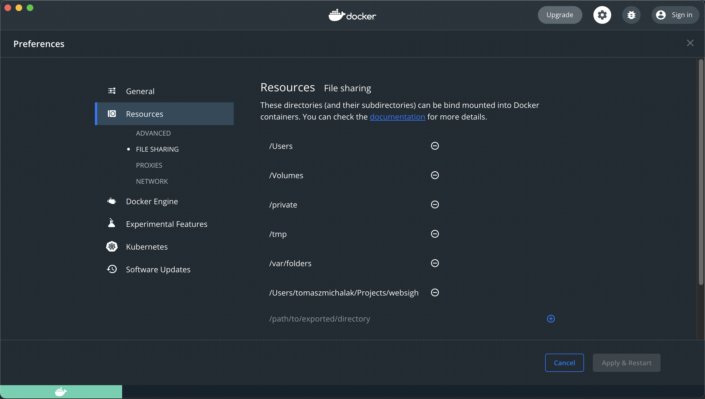
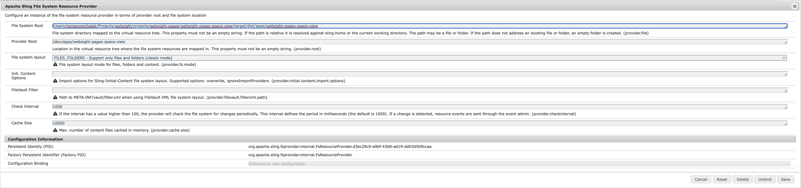

## Description

Tool to seamlessly synchronize local code changes with your WebSight instance (running as [a Java application](https://bitbucket.org/teamds-workspace/websight-starter/src/main/RUNNING.md) 
or [Docker container](https://bitbucket.org/teamds-workspace/websight-starter/src/main/)). 

## Requirements

- Node 16.x (the active LTS)

## How to use

Configure the module that you are actively working on e.g. `websight-pages/websight-pages-space-view`:

- install the [released package](https://www.npmjs.com/package/websight-localsync) as dev dependency:
  ```bash
  npm install -D websight-localsync@1.1.0
  ```
- add `watch` script entry in `package.json` e.g.:
  ```yaml
  "scripts": {
    ...
    "watch": "babel src/main/webapp/ --config-file ./babel/.babelrc.js --extensions \".js,.jsx,.ts,.tsx\" -d target/dist --copy-files --watch"
  }
  ```
- **[Docker only]** (more details [here](https://bitbucket.org/teamds-workspace/websight-starter/src/main/))
  - bind your `projects` root folder into Docker containers (`Docker Desktop` -> `Preferences` -> `File Sharing` -> add the new entry)
    
  - configure an additional volume pointing your `projects` root folder using the local driver in the `Starter` project (`websight-starter/docker/websight-tar.yaml`) by adding:
    ```yaml
    volumes:
      ...
      localsync:
        driver: local
        driver_opts:
          o: bind
          device: /Users/tomaszmichalak/Projects/websight/projects
          type: none
    ```
    (please replace that the `driver` option value with your one (the same you configured in `File Sharing` declaration))
  - point the new volume in the ICE container
    ```yaml
    services:
      ice:
        ...
        volumes:
          ...
          - localsync:/Users/tomaszmichalak/Projects/websight/projects:ro 
    ```
- run script either using `npx websight-localsync` or configure it as a `script` entry in `package.json`:
  ```yaml
  "scripts": {
    ...
    "sync": "websight-localsync"
  }
  ```
- verify in a separate console that the bundle is working correctly with the command:
  ```bash
  curl -v -X POST -u admin:admin http://localhost:8080/system/console/bundles/org.apache.sling.fsresource
  ```
  expected status code is `200`, others:
  - `301` authentication failed, check your `admin` credentials
  - `404` the bundle is missing

## How it works

Once we run `npx websight-localsync`

```bash
npx websight-localsync                                                                                                              ✔ ╱ 15:25:56
=== Setting up the the server... ===
Detected FsResourceProvider.
Added mapping
=== Starting sync with WS instance... ===
Added configuration with id: http://localhost:8080/system/console/configMgr/[Temporary PID replaced by real PID upon save] to FsResourceProvider
=== Starting code changes watch... ===

> watch
> babel src/main/webapp/ --config-file ./babel/.babelrc.js --extensions ".js,.jsx,.ts,.tsx" -d target/dist --copy-files --watch

Successfully compiled 33 files with Babel.
```

it connects to `localhost:8080` and add the `Apache Sling File System Resource Provider` configuration to map the JCR path (under `/dev/{PROJECT_NAME}`) 
to the local filesystem (basically `target/dist`).

In [localhost:8080/system/console/configMgr](http://localhost:8080/system/console/configMgr) you can check the configuration:


and check details



It also configures the environment (using JCR resource mapping) in a way that it first resolves `/dev` before `/apps`.

## How to publish

To publish a new package version modify `version` in `package.json` and run `npm publish`.
You need to be logged in to company's npm account. To log in use `npm login`. Reach @Michał Cukierman for credentials.

## Troubleshooting

### Switching to environment files versions does not work

You can see dev version of your code even though this script is not running:

Go to `http://localhost:8080/system/console/configMgr` and search for `Apache Sling File System Resource Provider`. See if there are old mappings to your module and delete them.
